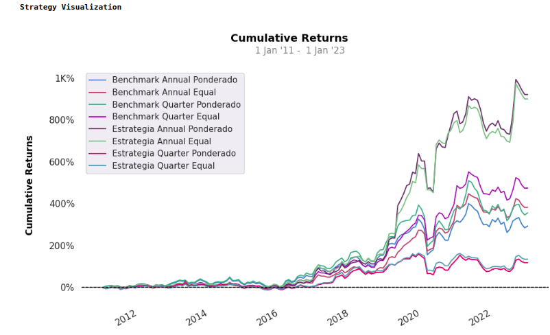
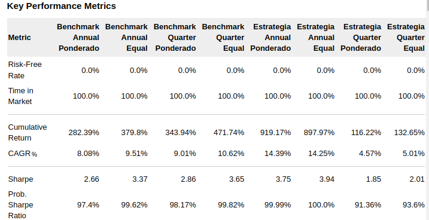
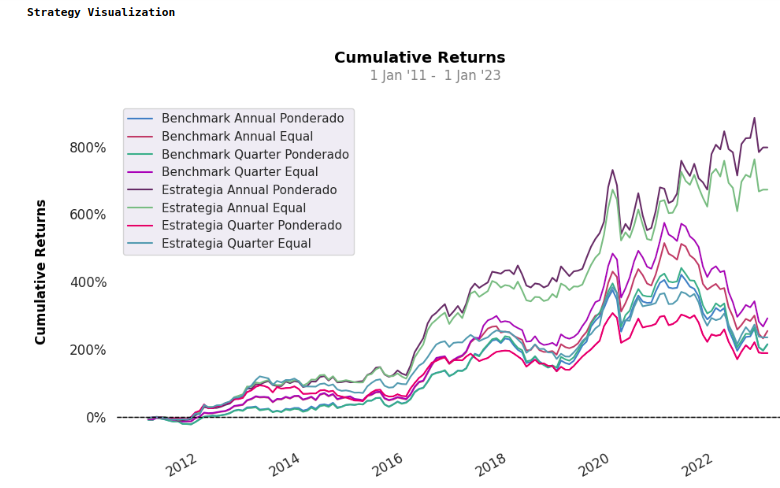
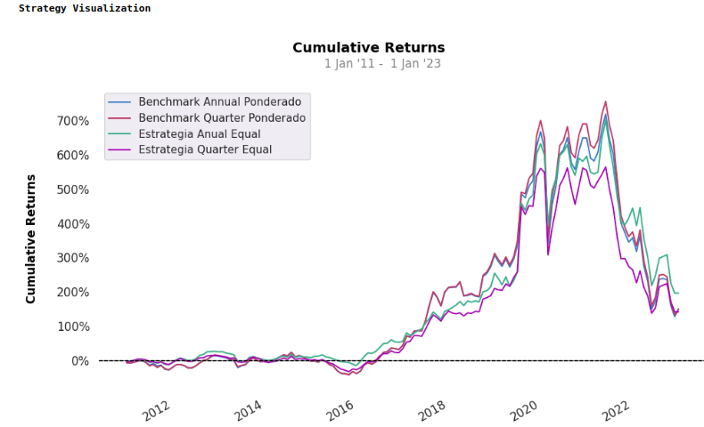
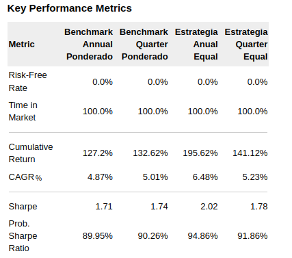
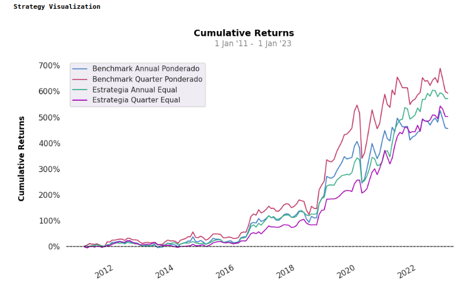
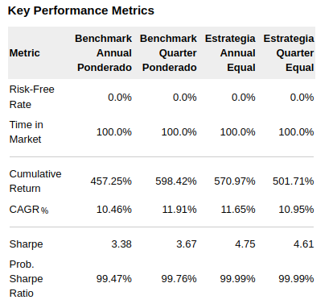
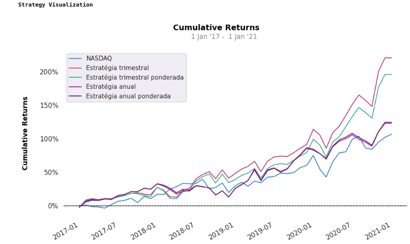
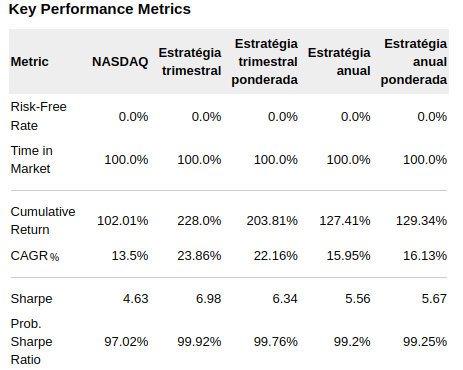
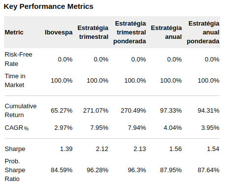

# Breve resumo do projeto de conclusão de curso 
**ESTRATÉGIA QUANTAMENTAL**: SELEÇÃO DE AÇÕES DA BOLSA DE VALORES BRASILEIRA

## Resumo do Projeto

Este projeto apresenta uma estratégia de investimento quantamental que integra elementos da análise fundamentalista e análise quantitativa. Os principais objetivos da pesquisa são analisar o desempenho da estratégia em setores específicos, como saúde, varejo, bancário e elétrico, e avaliar sua performance em comparação com o índice Ibovespa e NASDAQ.

## Abordagem Fundamentalista

A análise fundamentalista, introduzida por Benjamin Graham em sua obra "The Intelligent Investor" (GRAHAM, 1973), desempenha um papel central no universo dos investimentos. Sua ênfase está na minuciosa avaliação dos fundamentos financeiros de ativos, como ações e títulos, proporcionando uma compreensão profunda do valor intrínseco desses instrumentos. Durante a aplicação dessa abordagem, métodos de valuation, como o Fluxo de Caixa Descontado (FCD) e o Modelo de Gordon, desempenham um papel crucial.

O Fluxo de Caixa Descontado (FCD) concentra-se na projeção e avaliação criteriosa dos fluxos de caixa futuros, considerando a relevância do valor temporal do dinheiro ao longo do tempo. Enquanto isso, o Modelo de Gordon, especialmente aplicável a empresas que distribuem dividendos, destaca o valor das ações em relação aos dividendos projetados e à taxa de crescimento.

A análise fundamentalista oferece duas abordagens distintas: top-down e bottom-up. A abordagem top-down acredita que os movimentos de longo prazo no mercado são influenciados por variáveis macroeconômicas. Inicia-se com a avaliação de fatores como PIB, inflação, taxas de juros e estabilidade política para entender o ambiente de mercado. Por outro lado, a abordagem bottom-up enfoca as variáveis microeconômicas, começando pela análise de ações individuais independentemente do setor.

Essa abordagem abrangente destaca a importância de considerar tanto as variáveis macro quanto microeconômicas na análise fundamentalista, proporcionando uma visão holística para os investidores.
## Abordagem Quantitativa

A análise quantitativa, como delineado por Bell (2016), é uma abordagem que emprega princípios matemáticos e estatísticos para investigar o cenário financeiro. Essa metodologia desempenha um papel crucial na minimização de vieses e na redução do impacto do componente emocional na tomada de decisões dos investidores.

O ponto-chave da análise quantitativa é a sua escalabilidade, possibilitando a avaliação simultânea de milhares de ativos. Esse enfoque não apenas amplia a amplitude da análise, mas também capacita a identificação de tendências e a descoberta de oportunidades de investimento de forma mais eficiente. Ao depender de dados numéricos e modelos estatísticos, a análise quantitativa oferece uma perspectiva objetiva e baseada em evidências, contribuindo para decisões informadas no mercado financeiro

## Abordagem Quantamental

A abordagem quantamental busca combinar análises quantitativas e fundamentalistas em todas as etapas do processo de investimento. Visa explorar as especificidades da empresa e estatísticas de fatores para identificar oportunidades de desempenho excedente, combinando a profundidade da análise fundamentalista com a amplitude da análise quantitativa.

## Metodologia

### Análise Fundamentalista

A análise fundamentalista, implementada através do Modelo de Comparação de Múltiplos, emprega oito indicadores/múltiplos específicos para uma avaliação detalhada do desempenho financeiro de uma empresa em comparação com outras do mesmo setor.

Esses indicadores/múltiplos proporcionam uma visão abrangente da saúde financeira da empresa, indo além dos simples dados contábeis. Eles incluem métricas como Price to Earnings Ratio (P/E Ratio), Price to Book Ratio (P/B Ratio), entre outros, que juntos oferecem uma análise completa das condições econômicas e do valor de mercado da empresa. Essa abordagem permite uma compreensão mais profunda e fundamentada da posição da empresa em seu setor, sendo crucial para a tomada de decisões informadas no processo de investimento
### Análise Quantitativa

A abordagem quantitativa oferece a capacidade de comparar e avaliar o desempenho atual de uma empresa em relação aos trimestres anteriores. Essa metodologia fundamenta-se em métodos específicos, como F-score e G-score, que são utilizados para realizar uma análise intra-empresa.

Em termos simples, a análise quantitativa permite uma avaliação aprofundada da performance de uma empresa ao longo do tempo, destacando tendências, variações e mudanças significativas em suas métricas financeiras. O uso desses métodos específicos, como F-score e G-score, fornece uma abordagem sistemática e objetiva para avaliar a saúde financeira de uma empresa em comparação consigo mesma em períodos anteriores. Essa análise intra-empresa é valiosa para identificar padrões consistentes e entender como a empresa evolui ao longo do tempo

### Análise Quantamental

A estratégia quantamental é uma abordagem inovadora que incorpora técnicas de
análise fundamentalistas e quantitativas. Nesse sentido, o Score-Quantamental é formado
pela combinação dos resultados do Score-Fundamentalista e do Score-Quantitativo. Esse
método proporciona uma avaliação abrangente, integrando aspectos fundamentalistas e
quantitativos na análise de ativos. Isso proporciona uma pontuação que avalia o desempenho da empresa em relação aos
seus pares e também em comparação com os trimestres anteriores. As empresas com
as pontuações mais elevadas são aquelas que demonstraram um desempenho superior
nos últimos trimestres e estão relativamente subvalorizadas em comparação com seus
concorrentes.

A abordagem adotada inicia-se com uma análise minuciosa de setores individuais, na qual
se busca identificar as empresas destacadas em cada segmento. Esse enfoque possibilita
assegurar que essas empresas líderes apresentem uma base sólida do ponto de vista
fundamentalista em comparação com seus concorrentes e demonstrem um desempenho
consistente nos últimos trimestres. Após a análise setorial, a perspectiva é ampliada para
incluir ações de todo o Ibovespa, aplicando-se essa mesma metodologia seletiva. Dessa
forma, o processo abrange desde a identificação das melhores empresas em cada setor até
a análise mais abrangente do mercado no contexto do Ibovespa

## Análise dos Resultados

Os resultados são apresentados em três seções distintas:

1. **Setores Individuais:** Foco no desempenho em carteiras setoriais.
2. **NASDAQ:** Comparação com as 14 principais ações do NASDAQ por capitalização de mercado.
3. **Ibovespa:** Replicação da estratégia no conjunto de ações do Ibovespa.

### Setor Bancário

### Setor Saúde

### Setor Varejo

### Setor Elétrico

### NASDAQ

### Ibovespa

**Principais Indicadores de Desempenho:**
- Setor Bancário: Retorno acumulado de 919.17% (vs. 471.74% benchmark).
- Setor Saúde: Retorno acumulado de 797.16% (vs. 266.96% benchmark).
- Setor Varejista: Retorno acumulado de 195.62% (vs. 132.62% benchmark).
- Setor Elétrico: Retorno acumulado de 570.97% (vs. 598.42% benchmark).
- NASDAQ: Retorno acumulado de 228.0% (vs. 102.01% benchmark).
- Ibovespa: Retorno acumulado de 271.07% (vs. 65.27% benchmark).

## Melhorias e Considerações Futuras

Os resultados consistentes indicam a robustez da estratégia quantamental. Sugestões para melhorias futuras incluem a análise ajustada ao risco, personalização de indicadores por setor e a implementação de uma opção de venda (long-short) para ações menos atrativas. Essas melhorias visam fortalecer ainda mais a aplicabilidade prática da estratégia no dinâmico cenário do mercado financeiro.
